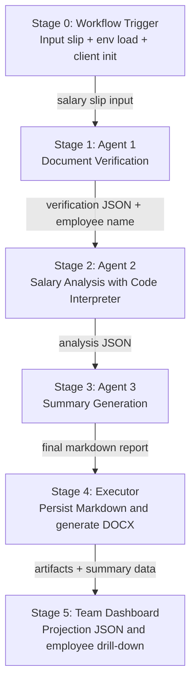

# Agent 3 Team Dashboard

Single-page React dashboard that summarizes Agent 3 verification outcomes for the team and provides links to each employee summary view.

## Microsoft Foundry Style Sequential Agent Flow

This project follows a Foundry-style multi-agent orchestration pattern with explicit stage contracts and deterministic handoff artifacts.



### Stage 0: Workflow Trigger

1. Input payload is a salary slip document (Markdown or JSON).
2. Runtime loads environment configuration (`OUTPUT_DIR`, Azure OpenAI settings, CSV path).
3. Orchestrator initializes the Azure OpenAI Responses client and creates the workflow execution context.

### Stage 1: Agent 1 - Document Verification Agent

1. Purpose:
   Validate structure, required fields, formatting, arithmetic consistency, and fraud indicators.
2. Input:
   Raw submitted salary slip text.
3. Processing contract:
   Agent must return strict JSON only (no prose / no markdown fences).
4. Output artifact:
   Verification JSON containing:
   - `document_valid`
   - `employee_name`
   - `employee_id`
   - `verification_checks`
   - `issues_found`
   - `verification_summary`
5. Handoff:
   Orchestrator extracts `employee_name` from Agent 1 output and forwards it to Agent 2.

### Stage 2: Agent 2 - Salary Analysis Agent (Code Interpreter)

1. Purpose:
   Analyze historical salary trends and validate income variation against thresholds.
2. Inputs:
   - Employee name from Agent 1.
   - Submitted slip for cross-reference.
   - Attached CSV manifest (`payslips_batch_manifest.csv`).
3. Processing contract:
   Agent uses code interpreter to:
   - Filter matching employee rows.
   - Normalize salary dates and numeric values.
   - Compute period-over-period and overall variation.
   - Apply decision thresholds:
     - `< 20%`: approve path
     - `20% to < 40%`: needs clarification
     - `>= 40%`: decline path
4. Output artifact:
   Structured JSON:
   - `employee_name`
   - `income_by_date[]`
   - `variation`
   - `valid`
   - `validation_reasoning[]`
5. Handoff:
   Full analysis JSON is passed to Agent 3 without lossy transformation.

### Stage 3: Agent 3 - Document Summary Agent

1. Purpose:
   Synthesize verification + salary analysis into a final business-facing report.
2. Inputs:
   - Agent 1 JSON result
   - Agent 2 JSON result
3. Processing contract:
   Must generate report markdown in the required section order:
   - Executive Summary
   - Document Verification
   - Salary Analysis
   - Final Decision
   - Notes & Observations
4. Decision policy:
   - `APPROVED`: document valid and salary valid
   - `REJECTED`: definitive invalid outcome
   - `NEEDS REVIEW`: clarification required
5. Output artifact:
   Canonical Markdown report used for both audit and UI summary pipelines.

### Stage 4: Executor Layer (Post-Agent)

1. Persist Agent 3 markdown report to `OUTPUT_DIR` with timestamped file name.
2. Convert markdown report to Word (`.docx`) using `python-docx` executor.
3. Return final execution result object with:
   - `verification`
   - `analysis`
   - `summary`
   - `markdown_report_path`
   - `word_doc_path`

### Stage 5: Team Dashboard Projection

1. Batch records are aggregated into `public/data/agent3_team_summary.json`.
2. Dashboard computes team KPIs and status segmentation.
3. Team table links (`#/employee/<EMP_ID>`) provide employee-level drill-down summaries.
4. Employee pages expose:
   - Final decision and validation flags
   - Timeline and variation breakdown
   - Source file traceability
   - Validation reasoning

### Operational Notes

1. This is a sequential orchestration design (Agent 1 -> Agent 2 -> Agent 3 -> Executor).
2. Stage outputs are explicit JSON/Markdown artifacts for observability and replay.
3. The dashboard is a read-model projection of workflow outputs, not an execution engine.

## Run

```bash
cd dashboard
npm install
npm run dev
```

## Data Source

The dashboard reads:

- `public/data/agent3_team_summary.json`

This file is generated from `../payslips_batch_manifest.csv` using the same variation policy used by the workflow.
